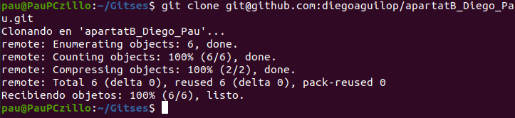

**1. Abans de crear el nostre primer repositori, haurem de configurar el nostre compte de GitHub amb una clau SSH per tal de poder-nos-hi connectar des del nostre ordinador. Seguiu el tutorial de la pàgina web de GitHub on indica com crear una clau SSH i el tutorial on explica com afegir la clau a GitHub. Inclou captures de pantalla del terminal on has creat el certificat i de la web de GitHub amb el certificat configurat.**

**2. Crea un nou repositori a GitHub amb el nom «vallbona». Inclou una captura de pantalla on aparegui el nou repositori.**

**3. Crea un repositori «vallbona» en el teu ordinador. Crea una branca «main» amb un fitxer «readme.md» dins. Fes-ne commit i puja el repositori a GitHub. Indica les comandes que has utilitzat.**
- Crear branca main: git branch main
He creat l’arxiu “README.md” amb nano i he fet commit.

**4. Crea una branca anomenada «dev» i actualitza el repostori amb GitHub. Indica la comanda utilitzada.**

**5. Crea un fitxer anomenat «index.html» i actualitza el repositori amb GitHub. Indica les comandes utilitzades**

Proba de que funciona:

**6. Crea el pull request amb un comentari indicant els canvis que has realitzat en el commmit que has fet. Adjunta una captura de pantalla un cop enviat el «pull request».**

**7. Accepta el pull request i realitza el merge amb «main». Adjunta captura de pantalla on es vegi que has realitzat el merge.**

**8. Torna al teu repositori local i situat a la branca «main». Està actualitzada amb el repositori de «GitHub»? Indica que cal fer per a que ho estigui. Escriu la comanda a realitzar.**
No ho està, hem de fer un pull.

**9. Clona el repositori «git@github.com:jvallbona/exercici2.git». Crea una branca anomenada «solucio». Indica la comanda que has utilitzat.**

**10. Realitza en la branca el que demana el fitxer «Exercici09.css» per tal que el fitxer HTML quedi com la imatge «Resultat09.png». Adjunta una imatge a pantalla completa del teu ordinador amb un navegador visualitzant el fitxer «Exercici09.html»**

**11. Puja el resultat en un repositori de la teva propietat. Adjunta el link per a poder-lo clonar.**
git@github.com:PauPerez/exercici2.git

**12. Realitza un «fork» del repositori «git@github.com:jvallbona/exercici2.git». Què ha passat? Adjunta una captura de pantalla del teu repositori.**

- s'ha copiat el repositori com a exercici2 **-1**, perque ja existía un amb el mateix nom.

**13. Crea una branca anomenada «dev» i situat en ella. Canvia la imatge del fons de pantalla per aquesta:  https://images.twinkl.co.uk/tr/image/upload/illustation/Birthday-Cake-.png Adjunta una captura de pantalla del navegador amb els canvis realitzats.**

**14. Puja els canvis al repositori de GitHub. Indica la comanda. Fes una captura de pantalla del pull request que s’ha creat. En quin repositori s’està demanant fer el pull a «main»? Escriu el teu nom en els comentaris del «pull request» i fes clic al botó «Create pull request»**
~~~
pau@PauPCzillo:~/Gitses/exercici2$ git push origin dev

Enumerando objetos: 5, listo.
Contando objetos: 100% (5/5), listo.
Compresión delta usando hasta 4 hilos
Comprimiendo objetos: 100% (3/3), listo.
Escribiendo objetos: 100% (3/3), 315 bytes | 315.00 KiB/s, listo.
Total 3 (delta 2), reusado 0 (delta 0)
remote: Resolving deltas: 100% (2/2), completed with 2 local objects.
remote: 
remote: Create a pull request for 'dev' on GitHub by visiting:
remote:      https://github.com/PauPerez/exercici2/pull/new/dev
remote: 
To github.com:PauPerez/exercici2.git
 * [new branch]      dev -> dev
pau@PauPCzillo:~/Gitses/exercici2$ 

~~~

- S'esta demanant fer el pull en el original, el que no te -1.

**15. Un dels membres del grup ha de crear un nou repositori privat en el seu compte de GitHub.
A continuació, haurà de convidar l’altre membre del grup i a l’usuari jselga a afegir-se com a col·laborador (secció Settings). 
Important: A la tasca indiqueu el nom d’usuari que crea al repositori**

**16. Tots dos alumnes heu de crear-vos un repositori local, amb el nom que desitgeu. Cal crear una carpeta en local i crear el repositori Git per terminal.**

**17.        Feu commit cada alumne des del repositori local.
       Fixa’t que commit aplica els canvis en local, però fins que no fem push no s’envia al repositori remot.
       En refrescar al repositori de GitHub, s’han de veure els dos missatges de commit.**

**18. Proveu ara de crear fitxers en local (un fitxer per alumne amb noms diferents). Actualitzeu el repositori remot amb les comandes adequades i adjunteu captura dels canvis. Que passaria si els fitxers es diguessin igual?**

- Si els fitxers es diguessin igual hi hauria una colisió entre els dos commits, i hauriem de retirar un dels dos o cambiar el nom del fitxer o igualar el contingut.

**19.        Cada alumne ha de crear una nova branca amb un checkout. Per exemple les braques alumne1 i alumne2
       Proveu de crear cadascú diversos fitxers i fer push al repositori remot (sempre a la vostra branca!)
       Feu també la prova de canviar-vos amb checkout a la branca del vostre company. Observa com canvia el contingut de la teva carpeta local!**

- Els fitxers cambien per branca:

**20.        Crearem una branca dev, i cadascun dels alumnes farà merge amb la branca dev un cop finalitzi la seva feina.
       Feu tots els integrants del grup merge a la branca dev.**

**21.        Un cop fet el merge a develop, resolts els conflictes i «testejada l’aplicació», podem fer merge de la branca develop amb la master.**

