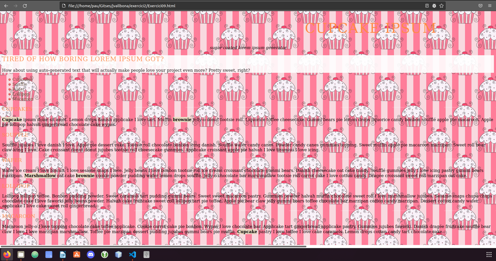

**1. Abans de crear el nostre primer repositori, haurem de configurar el nostre compte de GitHub amb una clau SSH per tal de poder-nos-hi connectar des del nostre ordinador. Seguiu el tutorial de la pàgina web de GitHub on indica com crear una clau SSH i el tutorial on explica com afegir la clau a GitHub. Inclou captures de pantalla del terminal on has creat el certificat i de la web de GitHub amb el certificat configurat.**

**2. Crea un nou repositori a GitHub amb el nom «vallbona». Inclou una captura de pantalla on aparegui el nou repositori.**

**3. Crea un repositori «vallbona» en el teu ordinador. Crea una branca «main» amb un fitxer «readme.md» dins. Fes-ne commit i puja el repositori a GitHub. Indica les comandes que has utilitzat.**
- Crear branca main: git branch main
He creat l’arxiu “README.md” amb nano i he fet commit.

**4. Crea una branca anomenada «dev» i actualitza el repostori amb GitHub. Indica la comanda utilitzada.**

**5. Crea un fitxer anomenat «index.html» i actualitza el repositori amb GitHub. Indica les comandes utilitzades**

Proba de que funciona:

**6. Crea el pull request amb un comentari indicant els canvis que has realitzat en el commmit que has fet. Adjunta una captura de pantalla un cop enviat el «pull request».**

**7. Accepta el pull request i realitza el merge amb «main». Adjunta captura de pantalla on es vegi que has realitzat el merge.**

**8. Torna al teu repositori local i situat a la branca «main». Està actualitzada amb el repositori de «GitHub»? Indica que cal fer per a que ho estigui. Escriu la comanda a realitzar.**
No ho està, hem de fer un pull.

**9. Clona el repositori «git@github.com:jvallbona/exercici2.git». Crea una branca anomenada «solucio». Indica la comanda que has utilitzat.**

**10. Realitza en la branca el que demana el fitxer «Exercici09.css» per tal que el fitxer HTML quedi com la imatge «Resultat09.png». Adjunta una imatge a pantalla completa del teu ordinador amb un navegador visualitzant el fitxer «Exercici09.html»**

**11. Puja el resultat en un repositori de la teva propietat. Adjunta el link per a poder-lo clonar.**
git@github.com:PauPerez/exercici2.git

**12. Realitza un «fork» del repositori «git@github.com:jvallbona/exercici2.git». Què ha passat? Adjunta una captura de pantalla del teu repositori.**

- s'ha copiat el repositori com a exercici2 **-1**, perque ja existía un amb el mateix nom.

**13. Crea una branca anomenada «dev» i situat en ella. Canvia la imatge del fons de pantalla per aquesta:  https://images.twinkl.co.uk/tr/image/upload/illustation/Birthday-Cake-.png Adjunta una captura de pantalla del navegador amb els canvis realitzats.**